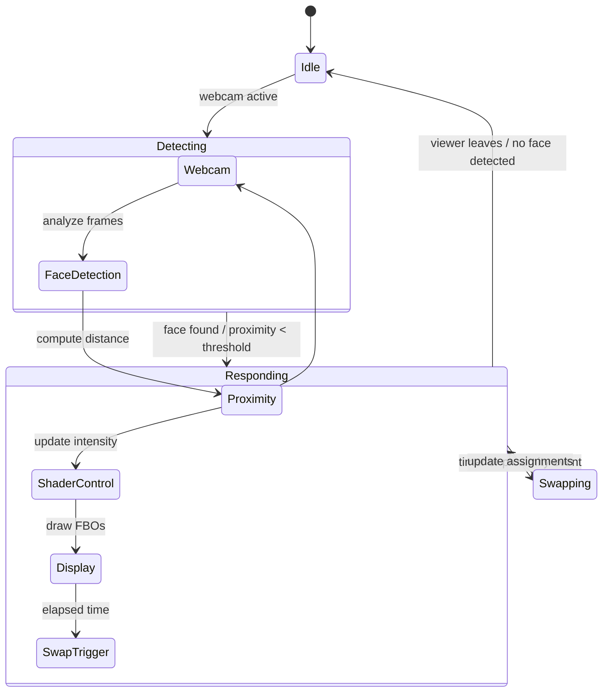

# Proximity Video System (Art Installation — OpenFrameworks Multi-Display)

## 🧠 Project Overview
This project is an **interactive video installation** built with **openFrameworks (C++)**, designed for **three independent video outputs** that are cloned across **twelve physical monitors** via HDMI splitters.  

The piece blends **live camera input**, **distance-based reactive filters**, and **pre-recorded videos**. It produces an evolving, dreamlike visual system in which imagery shifts based on how close a viewer stands to the camera.

---

## 🎯 Artistic Goals
- Create the illusion of a vast, networked audiovisual system using only three real GPU outputs.
- Make the system feel *alive* — responding to human proximity with subtle, organic visual mutations.
- Blend live perception (webcam feed) and memory (archival videos) across multiple monitors.
- Encourage viewers to move in space to modulate the installation’s visual state.

---

## 🏗️ Core Architecture

### 1. **Hardware Layout**
- **Inputs**: One USB webcam.
- **Outputs**:  
  - 3 GPU outputs → 3 HDMI splitters → 12 monitors (4 monitors per splitter).  
  - Each splitter group clones one output; physical monitor arrangement creates the illusion of individual control.
- **Computer**: Single PC with sufficient GPU capability (e.g., 3 HDMI or DisplayPort outputs).

### 2. **Software Components**
| Component | Description |
|------------|-------------|
| **`DisplayManager`** | Central controller. Handles webcam input, face/proximity detection, video playback, filter strength, and output assignments. |
| **`DisplayApp`** | Lightweight renderer attached to each logical window/output. Draws an assigned FBO (frame buffer) containing either webcam or video content. |
| **`main.cpp`** | Initializes three GLFW windows (one per GPU output) and binds each to a `DisplayApp` instance sharing the global `DisplayManager`. |
| **Shaders** | Apply dynamic filters (desaturation, RGB offset, blur, etc.) driven by proximity data. |

---

## 3. **Processing Pipeline**

1. **Webcam Capture** → via `ofVideoGrabber`.
2. **Proximity Detection** → via OpenCV (`CascadeClassifier`) measuring face size in pixels → normalized 0–1 proximity value.
3. **Filter Control** → proximity value modulates shader intensity and effect combinations.
4. **Video Playback** → all video files loaded from `data/movies/`, looped or sequenced in response to logic.
5. **Display Routing** →  
   - Three `ofFbo` targets, one per logical output.  
   - Each FBO shows either webcam feed or a selected video based on `windowAssignment[]`.  
   - `swapAssignments()` periodically changes which output shows which source, creating the illusion of distributed agency.
6. **Rendering** → Each `DisplayApp` draws its FBO fullscreen on a dedicated GPU output (and thus to its splitter group of monitors).

---

## 🔄 Behavioral Logic (State Diagram)

---

## ⚙️ Key Parameters
| Parameter | Purpose | Range / Notes |
|------------|----------|---------------|
| `proximity` | Normalized distance metric | 0.0 (far) – 1.0 (close) |
| `swapInterval` | Time between reassignment events | seconds |
| `videoFolder` | Path to prerecorded content | e.g. `data/movies/` |
| `numOutputs` | Logical display count | 3 |
| `numMonitors` | Physical monitor count | 12 (via splitters) |

---

## 🧩 Dependencies
- **openFrameworks 0.12+**
- **ofxOpenCv** or **ofxCv**
- **GLSL shaders** for visual effects
- **GLFW multi-window** support

Optional:
- **ofxFaceTracker** for more robust distance estimation.
- **DeckLink SDK** (future expansion for pro video outputs).

---

## 🚀 Future Expansion Goals
- Introduce **multiple proximity sensors** (e.g., ultrasonic or ToF) to control individual output groups independently.  
- Add **sound-reactive layers** synchronized with video filters.  
- Enable **networked synchronization** across multiple machines (for >3 logical outputs).  
- Integrate **OSC / UDP control** for remote tuning or performance variations.  
- Port shaders and control logic to **AMP agents** for distributed processing and adaptive behaviors.

---

## 🧭 AMP Agent Suggestions
| Agent | Responsibility |
|--------|----------------|
| **CodeAgent** | Maintains and extends openFrameworks C++ source; handles video routing, FBO logic, and shaders. |
| **VisionAgent** | Optimizes and experiments with proximity detection, face tracking, and computer vision features. |
| **DisplayAgent** | Manages monitor/window mapping and ensures smooth multi-window rendering and synchronization. |
| **BehaviorAgent** | Tunes time-based transitions (`swapAssignments`, filter intensity curves, etc.). |
| **ArchiveAgent** | Manages folder of prerecorded videos; handles file addition, replacement, or playback scheduling. |
| **PerformanceAgent** | Benchmarks and optimizes GPU performance and frame rates across multiple outputs. |
| **DocumentationAgent** | Keeps technical and artistic documentation updated for AMP’s internal state graph. |

---

## 📄 Notes for AMP Integration
- Treat this project as a **hybrid creative system**: part computer-vision reactive software, part video routing engine.  
- Agents should share a single `DisplayManager` context or state map to coordinate parameter changes (e.g., proximity → filterIntensity → assignment).  
- Primary success metrics: frame rate stability, smooth transitions, accurate proximity response, and the visual illusion of distributed autonomy.
